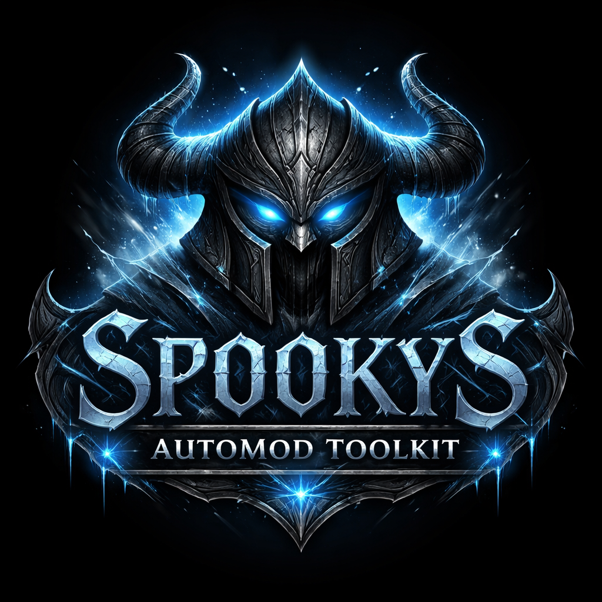

<p align="center">
  
</p>

<h1 align="center">Spooky's AutoMod Toolkit</h1>

<p align="center">
  <strong>CLI toolkit for creating Skyrim mods, designed for use with AI assistants</strong>
</p>

---

## Overview

A command-line toolkit that enables AI assistants (Claude, ChatGPT, etc.) to create and modify Skyrim mods programmatically. Simply describe what you want and let the AI handle the technical work.

```
> "Create a sword called Frostbane that does 30 damage"
> "Decompile the scripts from this mod so I can see how it works"
> "Add a new perk to my existing mod"
```

Create new mods, inspect existing ones, extract archives, decompile scripts, and more.

---

## Requirements

- **Windows**
- **.NET 8.0 SDK** - [Download](https://dotnet.microsoft.com/download/dotnet/8.0)
- **Skyrim Special Edition** (for testing)

---

## Installation

**Option A: Download ZIP**

1. Click "Code" > "Download ZIP"
2. Extract to a folder (e.g., `C:\Tools\spookys-automod-toolkit`)

**Option B: Git**

```bash
git clone https://github.com/yourusername/spookys-automod-toolkit.git
```

**Build:**

```bash
cd spookys-automod-toolkit
dotnet build
```

**Verify:**

```bash
dotnet run --project src/SpookysAutomod.Cli -- --help
```

---

## Papyrus Script Headers (Required for Compilation)

If you plan to compile Papyrus scripts, you'll need the script headers from the Creation Kit.

### What Are Script Headers?

Script headers (`.psc` files) define the base types used by Papyrus scripts, such as `Actor`, `Game`, `Quest`, `GlobalVariable`, etc. Without these headers, the Papyrus compiler cannot understand script code and will fail with "invalid type" errors.

### Where to Get Them

**DO NOT download headers from the internet** - they are copyrighted by Bethesda.

You must obtain them from your own Creation Kit installation:

1. **Download Creation Kit:**
   - Skyrim SE: Available on Steam (Tools section)
   - Skyrim VR: Use Skyrim SE Creation Kit

2. **Locate Headers:**
   - Navigate to: `<Creation Kit Install>/Data/Scripts/Source/`
   - You'll find files like `Actor.psc`, `Game.psc`, `Quest.psc`, etc.

### Installation

**Option A: Copy to toolkit directory (Recommended)**

Copy all `.psc` files from Creation Kit to the toolkit's `skyrim-script-headers/` directory (in the toolkit root folder):

```bash
# From the toolkit root directory (spookys-automod-toolkit/)

# Windows PowerShell
Copy-Item "C:\Program Files (x86)\Steam\steamapps\common\Skyrim Special Edition\Data\Scripts\Source\*.psc" `
  ".\skyrim-script-headers\"

# Git Bash / WSL
cp "/c/Program Files (x86)/Steam/steamapps/common/Skyrim Special Edition/Data/Scripts/Source/"*.psc \
  ./skyrim-script-headers/
```

This will place the headers in: `spookys-automod-toolkit/skyrim-script-headers/*.psc`

**Option B: Use Creation Kit path directly**

You can also reference the Creation Kit headers directly using the `--headers` flag:

```bash
papyrus compile "./Scripts" --headers "C:/Program Files (x86)/Steam/steamapps/common/Skyrim Special Edition/Data/Scripts/Source"
```

### Important Notes

- **Directory Location:** The `skyrim-script-headers/` directory is in the toolkit root (same level as `src/`, `docs/`, etc.)
- **Empty by Default:** The directory exists but contains no `.psc` files - you must copy them from Creation Kit
- **VR vs SE:** If targeting Skyrim VR, use headers from the VR-compatible Creation Kit
- **Copyright:** DO NOT commit `.psc` headers to version control - they are Bethesda's intellectual property
- **Git Ignore:** The `.gitignore` file already excludes `skyrim-script-headers/*.psc` to prevent accidental commits

### Advanced: SKSE and SkyUI Headers

For compiling mods that use **SKSE** (Skyrim Script Extender) or **SkyUI** (MCM menus), additional headers are required:

**SKSE Headers:**
- Required for: Mods using SKSE functions (`GetDisplayName`, `RegisterForMenu`, `StringUtil`, etc.)
- Download: https://skse.silverlock.org/ (get the SDK package)
- Install to: `tools/papyrus-compiler/headers/skse/`
- Extract `Scripts/Source/` contents to this directory

**SkyUI Headers:**
- Required for: Mods with MCM (Mod Configuration Menu)
- Download: https://github.com/schlangster/skyui/wiki or Nexus Mods
- Install to: `tools/papyrus-compiler/headers/skyui/`
- Copy MCM scripts (`SKI_ConfigBase.psc`, etc.) to this directory

The compiler automatically detects and uses these headers when present. See `tools/papyrus-compiler/headers/README.md` for detailed setup instructions.

---

## Quick Start

### Create a Plugin

```bash
dotnet run --project src/SpookysAutomod.Cli -- esp create "MyMod" --light --author "YourName"
```

### Add a Book

```bash
dotnet run --project src/SpookysAutomod.Cli -- esp add-book "MyMod.esp" "MyBook" --name "Ancient Tome" --text "Long ago, in a land far away..." --value 50
```

### Add a Weapon (Requires model)

Weapons need a 3D model to be visible. Use `--model` to borrow a vanilla appearance:

```bash
dotnet run --project src/SpookysAutomod.Cli -- esp add-weapon "MyMod.esp" "MySword" --name "Blade of Legends" --type sword --damage 30 --model iron-sword
```

**Model presets:** `iron-sword`, `steel-sword`, `iron-dagger`, `hunting-bow`

### Add a Spell

Create spells with actual effects using `--effect`:

```bash
dotnet run --project src/SpookysAutomod.Cli -- esp add-spell "MyMod.esp" "MySpell" --name "Fire Blast" --effect damage-health --magnitude 50 --cost 45
```

**Effect presets:** `damage-health`, `restore-health`, `fortify-health`, `fortify-armor`, etc.

### Add a Perk

Create perks with gameplay effects using `--effect`:

```bash
dotnet run --project src/SpookysAutomod.Cli -- esp add-perk "MyMod.esp" "MyPerk" --name "Warrior's Might" --description "+25% damage" --effect weapon-damage --bonus 25 --playable
```

**Effect presets:** `weapon-damage`, `damage-reduction`, `spell-cost`, `sneak-attack`, etc.

### Check Your Mod

```bash
dotnet run --project src/SpookysAutomod.Cli -- esp info "MyMod.esp"
```

### Install

Copy `MyMod.esp` to your Skyrim `Data` folder and enable it in your mod manager.

---

## Using with AI

### Quick Setup

To get any AI assistant (ChatGPT, Claude, etc.) ready to use the toolkit:

1. **Copy the initialization prompt:** See [LLM Init Prompt](docs/llm-init-prompt.md)
2. **Paste it into your AI chat**
3. **Provide the toolkit path**
4. **Start making requests!**

The initialization prompt gives the AI all essential context in ~200 lines, including:
- Critical principles (--json flag, headers, models, effects)
- Common gotchas and what to avoid
- Quick reference for common tasks
- Error handling guidance

**Example request:**

**You:** "Create a mod with a set of thief armor and a matching dagger"

The AI will run the appropriate commands to create the plugin and add the records.

### Documentation

- **[LLM Init Prompt](docs/llm-init-prompt.md)** - Quick onboarding (copy & paste this!)
- **[LLM Guide](docs/llm-guide.md)** - Comprehensive patterns and examples

---

## Claude Code Skills

This toolkit includes **Claude Code Skills** - specialized instruction files that teach Claude Code how to use each module effectively. When you open a project with these skills, Claude automatically knows how to create mods, troubleshoot issues, and work with Skyrim files.

### Available Skills

| Skill | Trigger | Purpose |
|-------|---------|---------|
| `skyrim-esp` | Create plugins, add weapons/armor/spells/perks | Full ESP/ESL plugin creation and modification |
| `skyrim-papyrus` | Write scripts, fix script errors | Compile, decompile, validate, generate scripts |
| `skyrim-mcm` | Add mod settings menu | Create MCM Helper configurations |
| `skyrim-archive` | Package or extract BSA files | Read, extract, and create archives |
| `skyrim-nif` | Check meshes, find textures | Inspect and scale 3D mesh files |
| `skyrim-audio` | Work with voice files | Handle FUZ/XWM/WAV audio |
| `skyrim-skse` | Create native plugins | Generate SKSE C++ plugin projects |

### How It Works

Skills are located in `.claude/skills/` and are automatically detected by Claude Code. Each skill contains:

- **Description** - When to use this skill
- **Command Reference** - All available commands with options
- **Workflows** - Step-by-step examples for common tasks
- **Troubleshooting** - How to diagnose and fix issues

### Example Conversation

```
You: Create a fire damage spell that costs 50 magicka

Claude: I'll create a spell using the ESP module.
        [Runs: esp add-spell "MyMod.esp" "FireBlast" --name "Fire Blast"
               --effect damage-health --magnitude 40 --cost 50]

        Created spell "Fire Blast" that deals 40 fire damage for 50 magicka.
```

### Using Skills in Other Projects

Copy the `.claude/skills/` folder to any project where you want Claude to have Skyrim modding capabilities:

```bash
cp -r spookys-automod-toolkit/.claude/skills/ your-project/.claude/skills/
```

---

## Working with Existing Mods

The toolkit can also inspect, extract, and modify existing mods.

### Inspect a Mod

```bash
# Check plugin contents and record counts
esp info "SomeMod.esp"

# List master dependencies
esp list-masters "SomeMod.esp"

# See what's inside an archive
archive list "SomeMod.bsa" --limit 50

# Check what textures a mesh uses
nif textures "Meshes/Armor/CustomArmor.nif"

# Inspect MCM configuration
mcm info "MCM/Config/SomeMod/config.json"
```

### Extract and Decompile

```bash
# Extract all files from an archive
archive extract "SomeMod.bsa" --output "./Extracted"

# Decompile a script back to source
papyrus decompile "Scripts/SomeScript.pex" --output "./Source"

# Extract FUZ audio to XWM + LIP
audio extract-fuz "Sound/Voice/SomeMod.esp/NPC/Line.fuz" --output "./Audio"
```

### Modify an Existing Mod

```bash
# Add a new weapon to an existing plugin
esp add-weapon "ExistingMod.esp" "NewSword" --name "Bonus Sword" --damage 35 --model iron-sword

# Add a perk to an existing plugin
esp add-perk "ExistingMod.esp" "BonusPerk" --name "Extra Damage" --effect weapon-damage --bonus 15 --playable

# Merge records from one plugin into another
esp merge "Patch.esp" "MainMod.esp" --output "MainMod_Patched.esp"

# Scale a mesh
nif scale "Meshes/Weapon.nif" 1.5 --output "Meshes/Weapon_Large.nif"
```

### Troubleshooting Workflow

```bash
# 1. Check the plugin
esp info "BrokenMod.esp"

# 2. Extract the BSA
archive extract "BrokenMod.bsa" --output "./Debug"

# 3. Decompile scripts to find issues
papyrus decompile "./Debug/Scripts/BrokenScript.pex" --output "./Debug/Source"

# 4. Check mesh textures
nif textures "./Debug/Meshes/SomeArmor.nif"

# 5. After fixing, recompile
papyrus compile "./Debug/Source" --output "./Debug/Scripts" --headers "C:/Skyrim/Data/Scripts/Source"
```

---

## What You Can Create

### Works Immediately

| Type      | Description                                |
| --------- | ------------------------------------------ |
| Books     | Custom text, lore, journals                |
| Quests    | Quest framework for scripted content       |
| Globals   | Configuration variables                    |
| Spells    | Damage, heal, buff spells (use `--effect`) |
| Perks     | Combat, magic, stealth perks (`--effect`)  |
| MCM Menus | Mod configuration menus                    |
| Scripts   | Papyrus script templates                   |

### Needs `--model` Flag

| Type    | Notes                                     |
| ------- | ----------------------------------------- |
| Weapons | Use preset or vanilla path for appearance |
| Armor   | Use preset or vanilla path for appearance |

### Record Only (Advanced)

| Type | Notes                              |
| ---- | ---------------------------------- |
| NPCs | Need race/face data to be visible  |

---

## Limitations

This toolkit creates mod *data* (ESP records). It cannot create:

- 3D models (use Blender + NifTools)
- Textures (use Photoshop/GIMP)
- Custom NPC faces (use Creation Kit)
- World spaces, dungeons, terrain (use Creation Kit)
- Complex quest stages and objectives

However, you can reference any existing vanilla model with `--model`.

---

## Command Reference

### Plugin (esp)

```bash
esp create "ModName" --light --author "Name"
esp info "Mod.esp"
esp add-quest "Mod.esp" "QuestID" --name "Quest Name" --start-enabled
esp add-spell "Mod.esp" "SpellID" --name "Spell Name" --type spell
esp add-global "Mod.esp" "GlobalID" --type int --value 1
esp add-weapon "Mod.esp" "WeaponID" --name "Name" --type sword --damage 20 --model iron-sword
esp add-armor "Mod.esp" "ArmorID" --name "Name" --type light --slot body --rating 30 --model iron-cuirass
esp add-npc "Mod.esp" "NPCID" --name "Name" --level 20 --essential
esp add-book "Mod.esp" "BookID" --name "Name" --text "Content..."
esp add-perk "Mod.esp" "PerkID" --name "Name" --description "Effect" --playable
esp attach-script "Mod.esp" --quest "QuestID" --script "ScriptName"
esp generate-seq "Mod.esp" --output "./"
esp merge "Source.esp" "Target.esp" --output "Merged.esp"
esp list-masters "Mod.esp"
```

### Scripts (papyrus)

```bash
papyrus status
papyrus generate --name "ScriptName" --extends "Quest" --output "./Scripts"
papyrus compile "./Scripts/Source" --output "./Scripts" --headers "/path/to/skyrim/Scripts/Source"
papyrus decompile "Script.pex" --output "./Decompiled"
papyrus validate "Script.psc"
```

### Archives (archive)

```bash
archive info "Archive.bsa"
archive extract "Archive.bsa" --output "./Extracted"
archive create "./DataFolder" --output "MyMod.bsa" --game sse
archive status
```

### MCM (mcm)

```bash
mcm create "ModName" "Display Name" --output "./MCM/config.json"
mcm add-toggle "./config.json" "bEnabled" "Enable Feature"
mcm add-slider "./config.json" "fValue" "Multiplier" --min 0.5 --max 2.0
mcm validate "./config.json"
```

### SKSE (skse)

```bash
skse templates
skse create "PluginName" --template basic --output "./"
skse info "./ProjectFolder"
```

---

## Record Options

| Record | Options                                                          |
| ------ | ---------------------------------------------------------------- |
| Quest  | `--name`, `--priority`, `--start-enabled`, `--run-once`          |
| Spell  | `--name`, `--type`, `--cast-type`, `--target-type`               |
| Global | `--type` (short/long/float), `--value`                           |
| Weapon | `--name`, `--type`, `--damage`, `--value`, `--weight`, `--model` |
| Armor  | `--name`, `--type`, `--slot`, `--rating`, `--value`, `--model`   |
| NPC    | `--name`, `--level`, `--female`, `--essential`, `--unique`       |
| Book   | `--name`, `--text`, `--value`, `--weight`                        |
| Perk   | `--name`, `--description`, `--playable`, `--hidden`              |

---

## Modules

| Module    | Purpose                  |
| --------- | ------------------------ |
| `esp`     | Plugin files (.esp/.esl) |
| `papyrus` | Papyrus scripts          |
| `nif`     | 3D mesh reading          |
| `archive` | BSA/BA2 archives         |
| `mcm`     | Mod configuration menus  |
| `audio`   | Game audio files         |
| `skse`    | SKSE C++ plugin projects |

---

## External Tools

| Tool             | Purpose           | Auto-Download                                                        |
| ---------------- | ----------------- | -------------------------------------------------------------------- |
| papyrus-compiler | Compile scripts   | Yes                                                                  |
| Champollion      | Decompile scripts | Yes                                                                  |
| BSArch           | Create archives   | No - [Get from xEdit](https://github.com/TES5Edit/TES5Edit/releases) |

---

## JSON Output

All commands support `--json` for machine-readable output:

```bash
spookys-automod esp info "MyMod.esp" --json
```

---

## Troubleshooting

**"dotnet is not recognized"** - Install .NET 8 SDK

**"Build failed"** - Run `dotnet restore` then `dotnet build`

**"Tool not found"** - Run `papyrus status` to check/download tools

**"BSArch not found"** - Download from xEdit releases, place `BSArch.exe` in `tools/bsarch/`

---

## Links

- [Full Documentation](docs/README.md)
- [LLM Usage Guide](docs/llm-guide.md)

---

## License

MIT